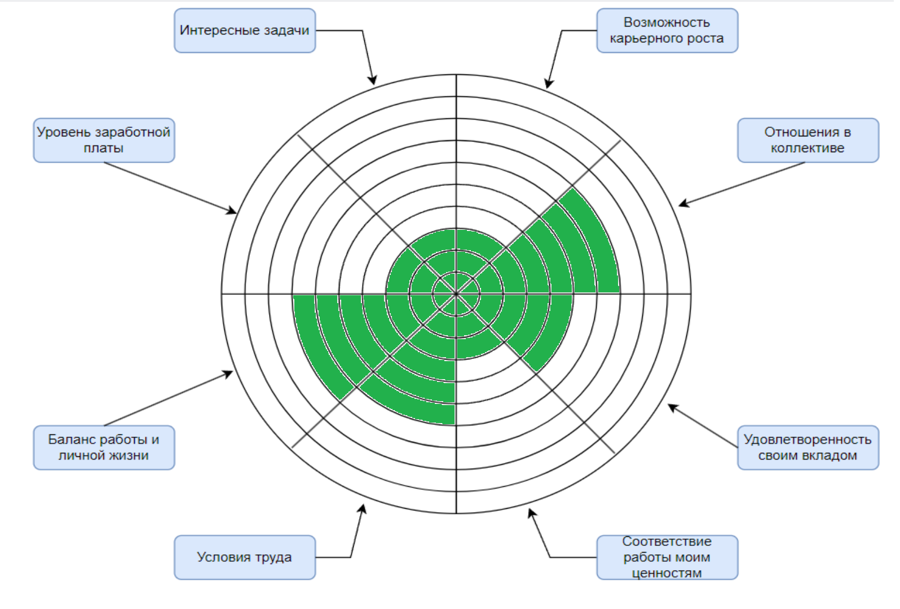
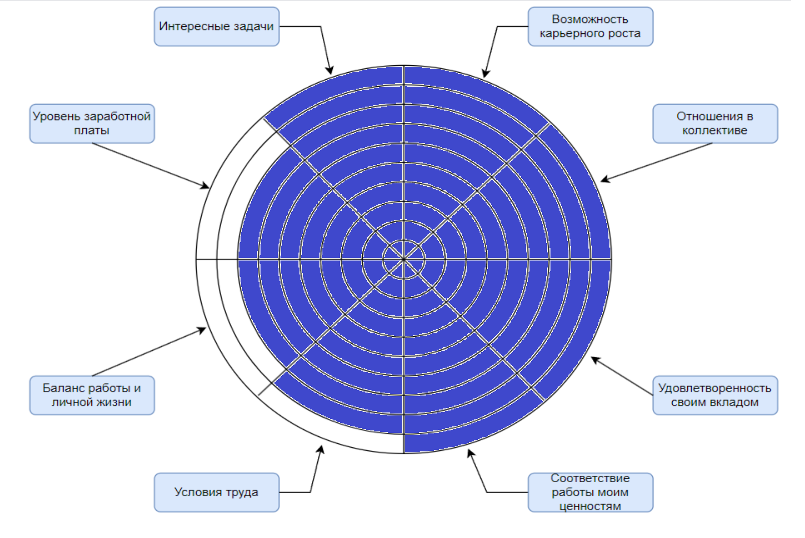

## Exercise 00 
### Колесо карьерного баланса

Колесо карьерного баланса с критериями выбора работы и их оценка с моей стороны на данный момент представлены на рисунке ниже.

Колесо с теми же критериями ожидаемое в будущем, на рисунке ниже.

Далее описаны действия, необходимые для достижения представленных выше изменений.

#### 1. Возможности для карьерного роста:

Текущая оценка: 3.\
Оценка в будущем: 10.\
Шаги:

Стать востребованным Java-разработчиком:
- получить опыт работы;
- развивать свои навыки и знания.

Искать возможности для роста:
- рассматривать предложения о более высокооплачиваемой работе;
- развивать лидерские качества;
- брать на себя дополнительные задачи.

#### 2. Отношения в коллективе:

Текущая оценка: 7. \
Оценка в будущем: 10.\
Шаги:

- быть дружелюбным и открытым (общаться с коллегами, помогать другим);
- участвовать в общественных мероприятиях компании;
- уметь работать в команде(уважать мнение других, быть готовым к компромиссам, делать свой вклад в общий результат).

#### 3. Удовлетворенность своим вкладом:

Текущая оценка: 5.\
Оценка в будущем: 10.\
Шаги:

- ставить перед собой амбициозные цели("написать код, который будет использоваться миллионами людей", "помогать другим людям развиваться в своей карьере");
- развитие навыков (определение необходимых навыков, практика в применении полученных знаний);
- возложить на себя ответственность (предлагать новые идеи, брать на себя сложные задачи)
- получение обратной связи (от руководителя, коллег и клиентов);
- отслеживание своего прогресса, достижений;
- помощь другим (делиться своими знаниями и опытом);
- позитивное отношение к работе, вера в свои силы, настойчивость.

#### 4. Соответствие работы моим ценностям:
Текущая оценка: 3.\
Оценка в будущем: 10.\
Шаги:

- определение своих ценностей (что для меня важно в жизни и в работе, какую пользу хочу приносить?);
- поиск работы, соответствующей моим ценностям (не готов работать в микрокредитных организациях, организациях по продаже табака или алкоголя; хочу работать в компании, которая помогает пожилым, разрабатывает сервисы, которые помогает людям в трудной жизненной ситуации).

#### 5. Условия труда:
Текущая оценка: 6.\
Оценка в будущем: 9.\
Шаги:

- определение желаемых условий, какие факторы наиболее важны (комфортное рабочее место, график работы, возможность удаленной работы, соцпакет);
- при поиске работы рассмотреть варианты с более комфортными условиями;
- повышение своей квалификации (позволит претендовать на более высокооплачиваемую работу с более комфортными условиями);

#### 6. Баланс работы и личной жизни:

Текущая оценка: 7. \
Оценка в будущем: 8. \
Шаги:

- научиться правильно планировать время (использовать приложения для управления задачами, ставить реалистичные цели, делегировать задачи, не брать на себя слишком много работы);
- находить время для себя (заниматься спортом, проводить больше времени с семьей).

#### 7. Уровень заработной платы:

Текущая оценка: 3. \
Оценка в будущем: 8. \
Шаги:

- изучить основы Java, ООП, алгоритмы и структуры данных;
- создать профиль на GitHub, загрузить свои наиболее удачные проекты;
- составить резюме, ориентированное на Java-разработку;
- изучить рынок труда и требования к Java-разработчикам;
- отправлять резюме на вакансии и готовиться к собеседованиям.

#### 8. Интересные задачи:

Текущая оценка: 3. \
Оценка в будущем: 10. \
Шаги:

- изучить различные области применения Java(Web-разработка, мобильная разработка (Android), разработка настольных приложений (JavaFX), Data Science (Apache Spark));
- выбрать область, которая наиболее интересна (учитывать свои навыки, интересы и перспективы развития);
- углублять знания в выбранной области;
- изучать новые технологии и фреймворки;
- получать опыт работы над реальными задачами;
- общение с другими разработчиками.
